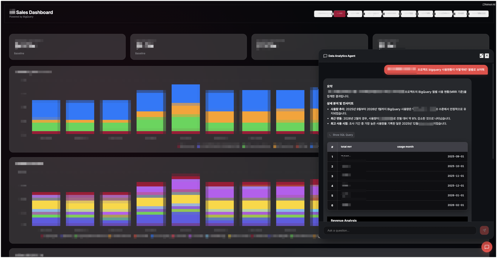

# Sales Revenue Dashboard



A professional dashboard for tracking and analyzing LG Sales Revenue data, featuring an AI-powered Data Analytics Agent for conversational insights, automated chart generation, and interactive data tables.

## 🚀 Architecture
- **Frontend**: React 19 + Vite + Tailwind CSS + Recharts + Vega-Lite
- **Backend**: FastAPI + Python 3.10
- **Data Source**: Google Cloud BigQuery
- **AI Engine**: Google Cloud Gemini Conversational Analytics API (BigQuery Agent)

---

## 💻 Local Development

### 1. Backend Setup
1.  Navigate to the `backend/` directory.
2.  Create a `.env` file with the following variables:
    ```env
    DATA_AGENT_ID=your_agent_id
    BILLING_PROJECT=your_project_id
    LOCATION=global
    DATASET_ID=your_dataset
    TABLE_ID=your_table
    ```
3.  Install dependencies:
    ```bash
    pip install -r requirements.txt
    ```
4.  Run the server:
    ```bash
    python main.py
    ```
    *The API will be available at `http://localhost:8080` (or the port defined in your $PORT environment variable).*

### 2. Frontend Setup
1.  Navigate to the `frontend/` directory.
2.  Install dependencies:
    ```bash
    npm install
    ```
3.  Run the development server:
    ```bash
    npm run dev
    ```
    *The dashboard will be available at `http://localhost:5173`.*

---

## ☁️ Cloud Run Deployment

The project is configured for a single-container deployment via a multi-stage `Dockerfile`.

### Automated Deployment
Run the following command from the **root directory** to build the image and deploy to Cloud Run:

```bash

gcloud run deploy sales-dashboard \
  --source . \
  --region us-central1 \
  --allow-unauthenticated \
  --set-env-vars="BILLING_PROJECT=$BILLING_PROJECT,LOCATION=$LOCATION,DATA_AGENT_ID=$DATA_AGENT_ID,DATASET_ID=$DATASET_ID,TABLE_ID=$TABLE_ID"
```

### Manual Container Build (Optional)
To build and run the container locally for testing:
```bash
docker build -t sales-dashboard .
docker run -p 8080:8080 -e PORT=8080 sales-dashboard
```

---

## 🛠 Features
- **Data Assistant (Chat)**: Powered by **Gemini Conversational Analytics API (BigQuery Agent)** for natural language data analysis.
- **Dynamic Charts**: Interactive revenue, project, and service analytics charts.
- **Persistent Sessions**: Chat history is maintained via conversational reference IDs.
- **Premium UI**: Dark-themed, high-contrast dashboard with responsive layouts.
